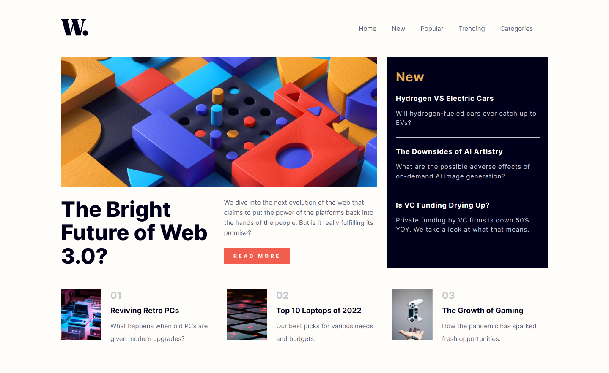
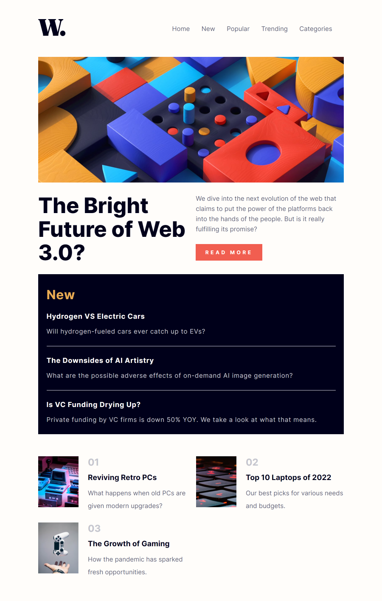
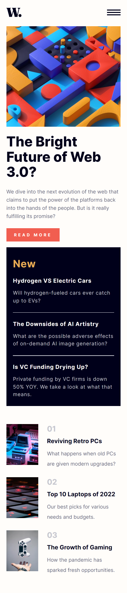

# Frontend Mentor - News homepage

This is a solution to the [News homepage challenge on Frontend Mentor](https://www.frontendmentor.io/challenges/news-homepage-H6SWTa1MFl). Frontend Mentor challenges help you improve your coding skills by building realistic projects. 

## Table of contents

- [Frontend Mentor - News homepage](#frontend-mentor---news-homepage)
  - [Table of contents](#table-of-contents)
  - [Overview](#overview)
    - [The challenge](#the-challenge)
    - [Screenshot](#screenshot)
    - [Links](#links)
  - [My process](#my-process)
    - [Built with](#built-with)
  - [Author](#author)

## Overview

### The challenge

Users should be able to:

- View the optimal layout for the interface depending on their device's screen size
- See hover and focus states for all interactive elements on the page

### Screenshot

- Desktop View

- Tablet View

- Mobile View
- 

### Links

- Solution URL: [Code](https://github.com/ChinatuL/News-Homepage)
- Live Site URL: [Live Site](https://chinatul.github.io/News-Homepage/)

## My process

### Built with

- Semantic HTML5 markup
- CSS custom properties
- Flexbox
- CSS Grid
- Desktop-First Workflow
- SASS
- Vanilla JavaScript

## Author
- Frontend Mentor - [@ChinatuL](https://www.frontendmentor.io/profile/ChinatuL)
- Twitter - [@ChinatuLucia](https://www.twitter.com/chinatulucia)

